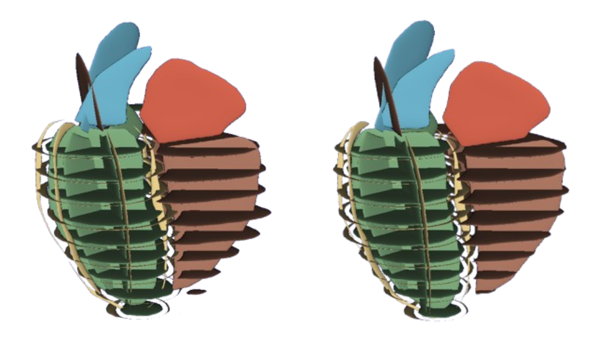
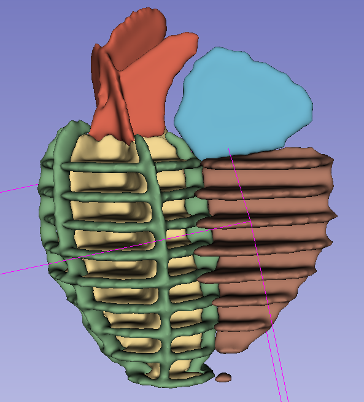

# Installation 

-----------------------------------------------
The easiest way to get this repo setup is to use the provided conda environment (python 3.11).
The conda environment named completeme311 can be created and activated with

```
cd label_completion_pipeline
conda create -n completeme311 python=3.11
conda activate completeme311
```

Install the requirements
```
pip install -r requirements.txt
```

Then, find the PyTorch right version for your GPU and OS ([here](https://pytorch.org/get-started/locally/)) and install it as described on the website. To see which version of cuda is suported on your computer, you can use the command 
``` nvidia-smi ```. If you see ```CUDA Version: 12.2``` for example, it means that you can install pytorch with a version of cuda up to 12.2.

# Usage
-----------------------------------------------

## Input folder organisation (This is for implementation without step 0 of slice shifting correction)
You can download toy example data from UKBiobank database. They should be placed in the label_completion_pipeline repository like so:

```
label_completion_pipeline
    └─images
    └─nets
    └─utils
    └─[...]
    └─example_data
        └─ UKBB_xxxx_xxxx   (patient's name)
            └─ UKBB_xxxx_xxxx_1   (folder containing the niftis for the 1st time frame)
                └─ LAX_2Ch_nnUNetSeg_f1_s1.nii.gz (2Ch nifti)
                └─ LAX_3Ch_nnUNetSeg_f1_s1.nii.gz (3Ch nifti)
                └─ LAX_4Ch_nnUNetSeg_f1_s1.nii.gz (4Ch nifti)
                └─ SAX_nnUNetSeg_f1_s1.nii.gz (first SAX nifti)
                [...]
                └─ SAX_nnUNetSeg_f1_s12.nii.gz (last SAX nifti)
            └─ UKBB_xxxx_xxxx_2   (folder containing the niftis for the 2nd time frame)
                [...]
            [...]
            └─ UKBB_xxxx_xxxx_N   (folder containing the niftis for the Nth time frame)
                [...]
``` 
## Slice shifting correction

### Step 0 (if needed): Convert UKBB segmentations from multi-frame NIFTI format into individual NIFTI files, with each file containing a single slice segmentation under each frame
To run the preprocessing for UKBB data, run 

```python data_preprocessing_ukbb.py -i /path/to/UKBB_data```
```
usage: data_preprocessing_ukbb.py [-h] [-i INPUT]
options:
  -h, --help            show this help message and exit
  -i INPUT, --input INPUT
                        Folder containing the niftis of UKBB segmentations
```

This script will save the niftis in `/path/to/UKBB_before_SSA` 

**EXAMPLE**

The structure of the input folder (`/path/to/UKBB_data`) should be as follows:
```
label_completion_pipeline
    └─UKBB
        └─ UKBB_xxxx_xxxx  - (patient's name)
            └─ Instance_2
                └─ Contour_Outputs
                └─ Contour_Outputs.50tf
                └─ LAX_2Ch.nii.gz
                └─ LAX_3Ch.nii.gz
                └─ LAX_4Ch.nii.gz
                └─ Mesh_Outputs
                └─ Mesh_Outputs.50tf
                └─ nnUNet_segs
                    └─  LAX_2Ch_nnUNetSeg.nii.gz
                    └─  LAX_3Ch_nnUNetSeg.nii.gz
                    └─  LAX_4Ch_nnUNetSeg.nii.gz
                    └─  SAX_nnUNetSeg.nii.gz
                └─ SAX.nii.gz
```

The structure of the output folder (`/path/to/UKBB_before_SSA`) should be as follows:
```
label_completion_pipeline
    └─UKBB_before_SSA
        └─ UKBB_xxxx_xxxx  - (patient's name)
            └─ UKBB_xxxx_xxxx_1 - (folder containing the niftis for the 1st time frame)
                └─ LAX_2Ch_nnUNetSeg_f1_s1.nii.gz - (2Ch nifti)
                └─ LAX_3Ch_nnUNetSeg_f1_s1.nii.gz - (3Ch nifti)
                └─ LAX_4Ch_nnUNetSeg_f1_s1.nii.gz - (4Ch nifti)
                └─ SAX_nnUNetSeg_f1_s1.nii.gz - (first SAX nifti)
                [...]
                └─ SAX_nnUNetSeg_f1_s12.nii.gz - (last SAX nifti)
```

### Step 1: Get misalignments using the ED frame
To run the slice shifting algorithm (SSA), run 

```python run_SSA.py -i /path/to/input/example_data -o /path/to/output/folder -ed ED_FRAME -s STEP```
```
usage: run_SSA.py [-h] [-i INPUT] [-o OUTPUT_PATH] [-ed ED_FRAME] [-s STEP]
options:
  -h, --help            show this help message and exit
  -i INPUT, --input INPUT
                        Folder containing the niftis at ED
  -o OUTPUT_PATH, --output_path OUTPUT_PATH
                        Path where to save the applied translations json file and corrected nifitis
  -ed ED_FRAME, --ed_frame ED_FRAME
                        ED frame number
  -s STEP, --step STEP  Calculate shifts or apply shifts: calculate shfits to apply on the ED frame. Infer: apply calculated shifts to remaining frames
```

This script will save the corrected niftis (ED frame only) in `/path/to/output/folder` and the applied translation will be saved in `/path/to/output/folder/patient_translation_file.json`


**EXAMPLE**

```python run_SSA.py -i ./example_data -o ./aligned_segmentations -ed 1 -s calculate``` will calculate the shifts on the first frame and save the aligned segmentation (Ed frame only) in the 'aligned_segmentations' folder. 
The structure of the `./aligned_segmentations` (`/path/to/output/folder`) should be as follows:
```
label_completion_pipeline
    └─aligned_segmentations
        └─ UKBB_xxxx_xxxx  - (patient's name)
            └─ UKBB_xxxx_xxxx_1 - (folder containing the niftis for the 1st time frame)
                └─ LAX_2Ch_nnUNetSeg_f1_s1.nii.gz - (2Ch nifti, shifted)
                └─ LAX_3Ch_nnUNetSeg_f1_s1.nii.gz - (3Ch nifti, shifted)
                └─ LAX_4Ch_nnUNetSeg_f1_s1.nii.gz - (4Ch nifti, shifted)
                └─ SAX_nnUNetSeg_f1_s1.nii.gz - (first SAX nifti, shifted)
                [...]
                └─ SAX_nnUNetSeg_f1_s12.nii.gz - (last SAX nifti, shifted)
            └─ UKBB_xxxx_xxxx_translation_file.json - file containing the applied shifts
```

Here is what you should get after running this script on the provided test data (left: before correction, right: after correction, ed frame=1):

Here I loaded the 14 niftis files from the output folder in 3D Slicer`./aligned_segmentations`

### Step 2: Apply the correction to the remaining frames
To apply the shifts on the remaining frames, run 

```python run_SSA.py -i /path/to/input/nifti -o /path/to/output/folder -ed ED_FRAME -s infer```

Ensure that the ED_FRAME number matches the one used for calculating the shifts `/path/to/output/folder/patient` and the `/path/to/output/folder` is the same we used for the previsou step.

**EXAMPLE**
```python run_SSA.py -i ./example_data -o ./aligned_segmentations -ed 1 -s infer``` will apply the shifts calculated on the first frame to the remaining frames and save them in `./aligned_segmentations`.

The structure of the `./aligned_segmentations` (`/path/to/output/folder`) should now be as follows:
```
label_completion_pipeline
    └─aligned_segmentations
        └─ UKBB_xxxx_xxxx  - (patient's name)
            └─ UKBB_xxxx_xxxx_1 - (folder containing the niftis for the 1st time frame)
                └─ LAX_2Ch_nnUNetSeg_f1_s1.nii.gz - (2Ch nifti, shifted)
                └─ LAX_3Ch_nnUNetSeg_f1_s1.nii.gz - (3Ch nifti, shifted)
                └─ LAX_4Ch_nnUNetSeg_f1_s1.nii.gz - (4Ch nifti, shifted)
                └─ SAX_nnUNetSeg_f1_s1.nii.gz - (first SAX nifti, shifted)
                [...]
                └─ SAX_nnUNetSeg_f1_s12.nii.gz - (last SAX nifti, shifted)
            └─ UKBB_xxxx_xxxx_2  - (folder containing the niftis for the 2nd time frame)
                └─ LAX_2Ch_nnUNetSeg_f1_s1.nii.gz - (2Ch nifti, shifted)
                └─ LAX_3Ch_nnUNetSeg_f1_s1.nii.gz - (3Ch nifti, shifted)
                └─ LAX_4Ch_nnUNetSeg_f1_s1.nii.gz - (4Ch nifti, shifted)
                └─ SAX_nnUNetSeg_f1_s1.nii.gz - (first SAX nifti, shifted)
                [...]
                └─ SAX_nnUNetSeg_f1_s12.nii.gz - (last SAX nifti, shifted)
            [...]
            └─ UKBB_xxxx_xxxx_N  - (folder containing the niftis for the Nth time frame)
            └─ UKBB_xxxx_xxxx_translation_file.json - file containing the applied shifts
```

## From 2D sparse segmentations to 3D sparse volumes
Now that all the slices have been aligned, we need to convert them into a 3D volume. An example input folder can be downloaded from UKBiobank database. To test this part of the pipeline, place the downloaded data like so:
```
label_completion_pipeline
    └─ aligned_segmentations
        └─ UKBB_xxxx_xxxx  - (patient's name)
            └─ UKBB_xxxx_xxxx_1 - (folder containing the niftis for the 1st time frame)
            └─ UKBB_xxxx_xxxx_2  - (folder containing the niftis for the 2nd time frame)
            [...]
            └─ UKBB_xxxx_xxxx_N  - (folder containing the niftis for the Nth time frame)
```

To do so, run ```python transform_to_volume.py -i /path/to/input/shifted/example_data -o /path/to/output/volume```
```
usage: transform_to_volume.py [-h] [-i INPUT] [-o OUTPUT_PATH]
options:
  -h, --help            show this help message and exit
  -i INPUT, --input INPUT
                        Folder containing the niftis after slice shifting
  -o OUTPUT_PATH, --output_path OUTPUT_PATH
                        Path where to save the 3D sparse volumes
```

**EXAMPLE**
Running `python transform_to_volume.py -i ./aligned_segmentations -o ./3d_sparse_volume` will convert the 2D segmentations in `aligned_segmentations` to 3D sparse volumes. The volumes will be saved in the `3d_sparse_volume folder`

After this step, the structure of the `3d_sparse_volume` (`/path/to/output/volume`) should now be as follows:
```
label_completion_pipeline
    └─3d_sparse_volume
        └─ UKBB_xxxx_xxxx  - (patient's name)
            └─ UKBB_xxxx_xxxx_1.nii.gz - (volume nifti for the first time frame)
            └─ UKBB_xxxx_xxxx_2.nii.gz - (volume nifti for the second time frame)
            [...]
            └─ UKBB_xxxx_xxxx_N.nii.gz - (volume nifti for the nth time frame)
```

Here is what you should get if you open `/path/to/label_completion_pipeline/3d_sparse_volume/UKBB_xxxx_xxxx/UKBB_xxxx_xxxx_1.nii.gz`



## From sparse volumes to 3D dense volumes

### Download models
The sparse-to-dense part of the pipeline uses deep learning models. They should be placed in the `label_completion_pipeline` folder like so:
```
label_completion_pipeline
    └─models 
        └─ DenseSpatialTransformerNetwork
            └─ stn_50.pt
            └─ [...]
        └─ LabelTransferNetwork
            └─ LTN_params_6_in_6_out.pth
            └─ LTN_params_6_in_11_out.pth
            └─ LTN_params_7_in_12_out.pth
```
The LTN model has flexibility in both input and output configurations (**remember to change line 264 in LTN.py accordingly**):

**Input options:**
- 6 labels: Background-0, LV-1, LV Myo-2, RV-3, RA-4, LA-5
- 7 labels: Background-0, LV-1, LV Myo-2, RV-3, RA-4, LA-5, RV Myo-6

**Output versions:**
- 6 labels: Background-0, LV-1, LV Myo-2, RV-3, RA-4, LA-5
- 11 labels: Background-0, LV-1, LV Myo-2, RV-3, RA-4, LA-5, Aorta-6, Pulmonary Artery-7, left pulmonary veins-8, right pulmonary veins-9, LA appendage-10
- 12 labels: Background-0, LV-1, LV Myo-2, RV-3, RA-4, LA-5, RV Myo-6, Aorta-7, Pulmonary Artery-8, left pulmonary veins-9, right pulmonary veins-10, LA appendage-11


To run the 2D sparse volume to 3D dense volume pipeline, run ```python from_sparse_to_dense_volume.py -i /path/to/2d/sparse/volume -o /path/to/output/folder -ltn_pth /path/to/LTN/checkpoint/file```

```
usage: from_sparse_to_dense_volume.py [-h] [-i INPUT] [-o OUTPUT_PATH] [-ltn_pth PATH_LTN] [--mode3d] [--dev DEV] [--seed SEED] [--stn {f}]

options:
  -h, --help            show this help message and exit
  -i INPUT, --input INPUT
                        Folder containing the 2D sparse volumes
  -o OUTPUT_PATH, --output_path OUTPUT_PATH
                        Path where to save the 3D one hot encoded sparse volumes
  -ltn_pth PATH_LTN, --path_ltn PATH_LTN
                        Path to the LTN checkpoint
  --mode3d              enable 3D mode
  --dev DEV             cuda device (default: 0)
  --seed SEED           random seed (default: 42)
  --stn {f}             stn type, f=full
```


**EXAMPLE**

An example input folder can be downloaded from UKBiobank database. To test this part of the pipeline, place the downloaded data like so:

```
label_completion_pipeline
    └─ 3d_sparse_volume
        └─ UKBB_xxxx_xxxx  - (patient's name)
            └─ UKBB_xxxx_xxxx_1.nii.gz - volume for the first time frame
            └─ UKBB_xxxx_xxxx_2.nii.gz - volume for the second time frame
            [...]
            └─ UKBB_xxxx_xxxx_N.nii.gz - volume for the Nth time frame
```

Running `python from_sparse_to_dense_volume.py -i ./3d_sparse_volume -o 3d_dense_volume` will convert the 3D sparse volumes in `3d_sparse_volume` to 3D dense volumes. The volumes will be saved in the `3d_dense_volume`

The structure of the `3d_dense_volume` should now be as follows:
```
label_completion_pipeline
    └─ 3d_dense_volume
        └─ UKBB_xxxx_xxxx
            └─ UKBB_xxxx_xxxx_1.nii.gz - (one-hot encoded sparse volume nifti for the first time frame)
            └─ UKBB_xxxx_xxxx_2.nii.gz - (one-hot encoded sparse volume nifti for the second time frame)
            [...]
            └─ UKBB_xxxx_xxxx_N.nii.gz - (one-hot encoded sparse volume nifti for the nth time frame)
        └─ UKBB_xxxx_xxxx_LTN
            └─ UKBB_xxxx_xxxx_1.nii.gz - (intermediate dense volume nifti for the first time frame, after LTN)
            └─ UKBB_xxxx_xxxx_2.nii.gz - (intermediate dense volume nifti for the second time frame after LTN)
            [...]
            └─ UKBB_xxxx_xxxx_N.nii.gz - (intermediate dense volume nifti for the nth time frame after LTN)
        └─ UKBB_xxxx_xxxx_LTN_LCC
            └─ UKBB_xxxx_xxxx_1.nii.gz - (intermediate dense volume nifti for the first time frame, after LTN and LCC)
            └─ UKBB_xxxx_xxxx_2.nii.gz - (intermediate dense volume nifti for the second time frame after LTN and LCC)
            [...]
            └─ UKBB_xxxx_xxxx_N.nii.gz - (intermediate dense volume nifti for the nth time frame after LTN and LCC)


```


