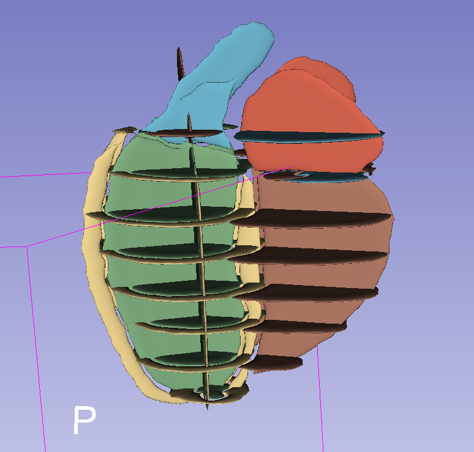

## Dense volume slicer
This script will generate 2D segmentations from a 3D dense volume. This is used for validation of this pipeline.

To run the volume slicer, run 

```python generate_nifti_from_dense_segmentation.py -i /path/to/input/example_data -o /path/to/output/folder```

```
usage: generate_nifti_from_dense_segmentation.py [-h] [-i INPUT] [-o OUTPUT_PATH]

options:
  -h, --help            show this help message and exit
  -i INPUT, --input INPUT
                        Folder containing the 3D dense volume
  -o OUTPUT_PATH, --output_path OUTPUT_PATH
                        Path where to save the synthesized 2D segmentations

```

This script will save the generated (synthesised) niftis in `/path/to/output/folder`. If you run the label completion piepline with this input, you should be getting the same results as the input data `/path/to/input/example_data` (the script has already been validated on this dataset)

**EXAMPLE**

You can find one toy data in the toy_data folder.

```python generate_nifti_from_dense_segmentation.py -i ./toy_data -o ./synthesized_segmentations``` will slice the volume in the 'toy_data' folder. 
The structure of the `./synthesized_segmentations` (`/path/to/output/folder`) should be as follows:
```
validation
    └─synthesized_segmentations
        └─ UKBB_8  - (patient's name)
            └─ motion_corrupted 
                └─ UKBB_8_LAX_2ch_1_-3.nii.gz  - generated 2D long axis segmentation, with a slice shift applied
                └─ UKBB_8_SAX_1_3_-1_apex.nii.gz - generated 2D short axis segmentation,  with a slice shift applied
                └─ [...]
            └─ motion_free  
                └─ UKBB_8_LAX_2ch_1_-3.nii.gz  - generated 2D long axis segmentation, without slice shift
                └─ UKBB_8_SAX_1_3_-1_apex.nii.gz - generated 2D short axis segmentation, without slice shift
                └─ [...]
```

Here is what you should get after running this script on the provided test data. Please not the slice shifting a done randomly so you might not get the same displacement

Here I loaded the 11 niftis files from the `./synthesized_segmentations/motion_corrupted` in 3D Slicer


If you use this generated output as input of the label completion pipeline, you should get the image on the right (left: original volume, right: reconstructed volume after going through the volume slicer and the label completion pipeline). Ideally, the result should be pretty close.
